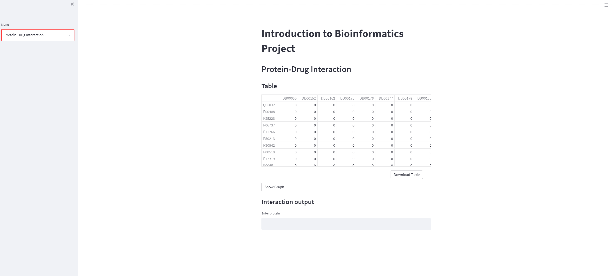

# Introduction to Bioinformatics project

## 1. Group Members
```
Mustafa Onur Başer
Mustafa Kaplan
Yusuf Çelik
```

## 2. Libraries:
- [node2vec](https://github.com/eliorc/node2vec)
- gensim
- matplotlib
- pandas 
- numpy
- networkx
- streamlit

## 3. How to run
- First in the terminal run `streamlit run streamlit.py` 
- Then user encounters the streamlit interface 

## 4. Example Page


